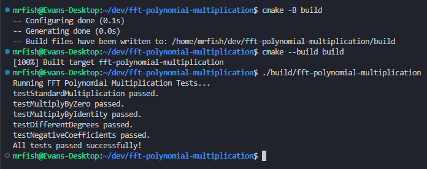

# Divide & Conquer Polynomial Multiplication via FFT <!-- omit in toc -->

- [Description](#description)
  - [The Problem](#the-problem)
  - [Implementation](#implementation)
  - [References / Further Reading](#references--further-reading)
- [How to Run](#how-to-run)
- [Runtime Sample](#runtime-sample)

## Description

This repo implements the Fast Fourier Transform (FFT) to multiply two polynomials efficiently. While the naive method of multiplying polynomials takes quadratic time, this divide-and-conquer approach reduces the time complexity to linearithmic time by switching between coefficient and point-value representations.

### The Problem

You are given two polynomials, $A(x)$ and $B(x)$, both of degree bound $n$:

$$
A(x) = \sum_{j = 0}^{n - 1}{a_j x^j}
$$

$$
B(x) = \sum_{j = 0}^{n - 1}{b_j x^j}
$$

The goal is to compute their product, $C(x) = A(x) \cdot B(x)$, which is a polynomial of degree bound $2n - 1$.

### Implementation

This implementation utilizes the Cooley-Turky FFT algorithm. It works by converting the polynomials from their standard coefficient representation into a point-value representation, multiplying them in linear time, and then converting the result back.

**Algorithm Steps:**

1. **Pad with Zeros:** Ensure the degree bound $n$ of the polynomials is a power of 2 by padding the higher-order coefficients with zeros. The new size must be at least the degree of the resulting polynomial to prevent aliasing.
2. **Evaluation (Forward FFT):** Evaluate both $A(x)$ and $B(x)$ at the $n$-th complex roots of unity to convert them into point-value representation. The FFT algorithm accomplishes this in $O(n \log{n})$ time by recursively splitting the polynomial into its even-indexed and odd-indexed coefficients:

    $$
    A(x) = A_{even}(x^2) + x A_{odd}(x^2)
    $$

3. **Point-wise Multiplication:** Multiply the evaluated point-values of $A$ and $B$ together. Since they are evaluated at the exact same $n$ points, this takes $O(n)$ time:

    $$
    y_k = A(w^k_n) \cdot B(w^k_n)
    $$

4. **Interpolation (Inverse FFT):** Convert the resulting point-value representation back to standard coefficient form. This uses the exact same recursive FFT algorithm, but utilizes the inverse roots of unity $w^{-k}_n$ and divides the final results by $n$.

**Complexity:**

- **Time Complexity:** $O(n \log{n})$. The Forward FFT takes $O(n \log{n})$ time, the point-wise multiplication takes $O(n)$ time, and the Inverse FFT takes $O(n \log{n})$ time.
- **Space Complexity:** $O(n)$ to store the recursive call stack and the arrays of complex numbers.

**Code:**

The C++ implementation is divided into two primary functions:

1. `multiplyPolynomials`, a wrapper that manages the mathematical pipeline and memory. This function manages the data preparation, pointwise multiplication, and final integer conversion.
2. `fft`, a recursive function that performs the actual Fast Fourier Transform.

Both of the function implementations are available in the [MultiplyPolynomials.cpp](./src/MultiplyPolynomials.cpp) file.

### References / Further Reading

T. H. Cormen, C. E. Leiserson, R. L. Rivest, and C. Stein, Introduction to Algorithms, Fourth Edition. MIT Press, 2022. (Chapter 30 specifically talks about polynomials and FFT).

“FFT · Arcane Algorithm Archive.” <https://www.algorithm-archive.org/contents/cooley_tukey/cooley_tukey.html>

## How to Run

This repo uses CMake for the build system. To run, ensure you have a valid C++ / C compiler installed.

```bash
cd ./fft-polynomial-multiplication

cmake -B build

cmake --build build

./build/fft-polynomial-multiplication
```

## Runtime Sample

Here is a sample of building and running the program:


